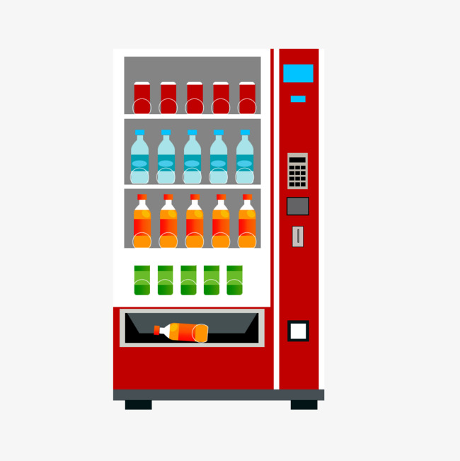

# Coding

## Vending Machine

### Task

Write a program to implement vending machine

### Business rules:

1. The machine accepts coins of 1, 2, 5, 10, 20, and 50 cents.

2. There are 3 different types of products:
    - A - costs USD 0.95
    - B - costs USD 1.26
    - C - costs USD 2.33

3. User can buy products by entering coins (Ex: `20 20 10 1 5`) and selecting a product (Ex: `A`, `B`, `C`)

4. Then the machine gives out the change in the least possible amount of coins. (Ex: `50 50 20 5 2 1`)

### Notes

- There is a template for the program in `./solution` folder
- You should install dependencies there with `npm i`
- You should run  `npm run test` for unit tests launched in watch mode during the hometask
- Unit tests should pass for your solution
